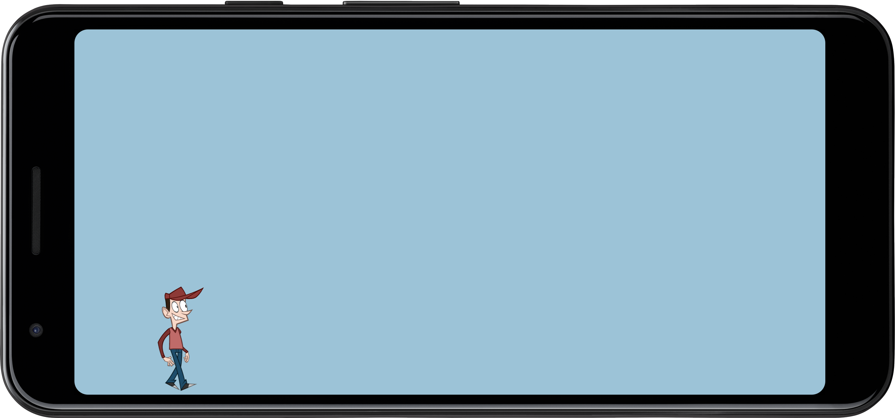

libGDX Sprite Sheet Example
===========================

Sample code which demonstrates how to use sprite sheets generated with 
[TexturePacker](https://www.codeandweb.com/texturepacker) in a
[libGDX](https://libgdx.com) application.

A detailed tutorial can be found
[here](https://www.codeandweb.com/texturepacker/tutorials/libgdx-sprite-sheet-tutorial).

